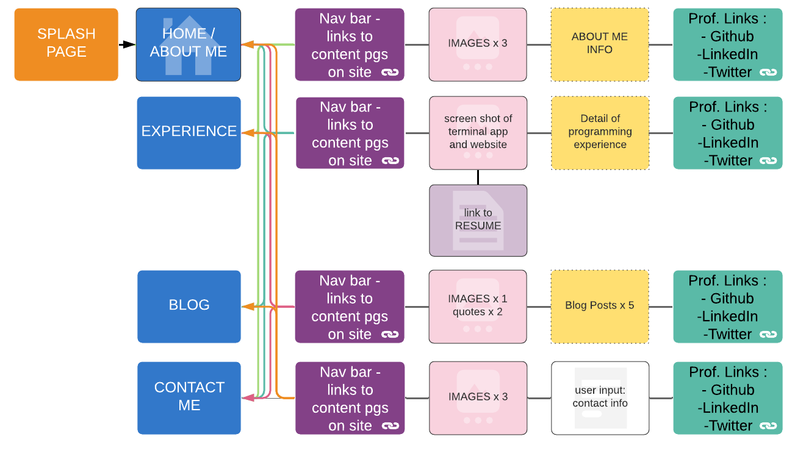
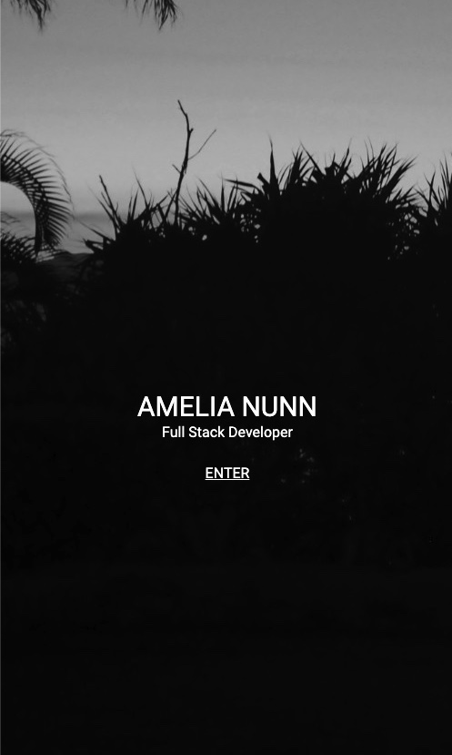
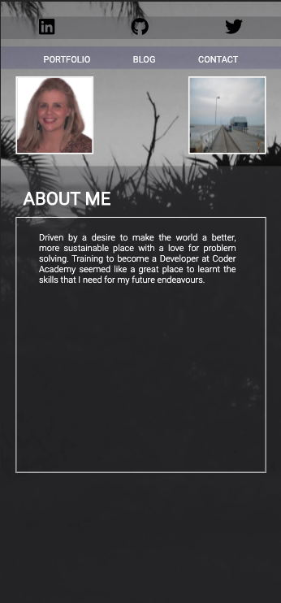
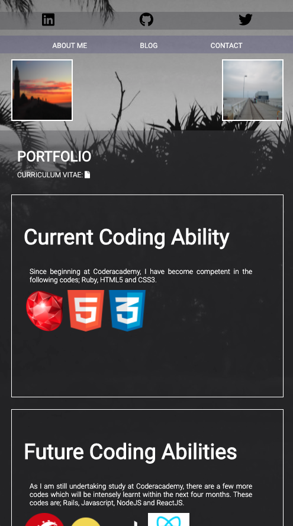
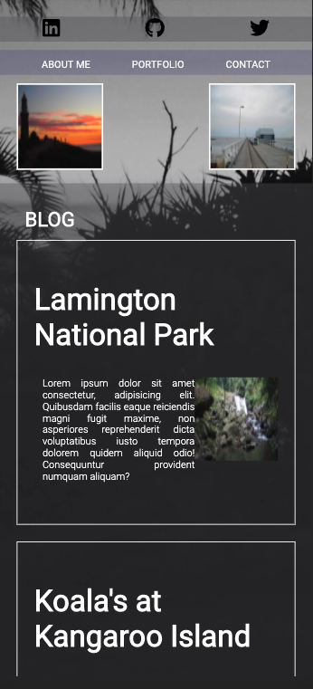
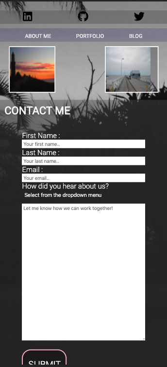

# PORTFOLIO WEBSITE:

[DEPLOYED SITE](https://highpitchit.github.io/portf/)

[MY PORTFOLIO ON GITHUB](https://github.com/highpitchit/Portfolio)

## 1.0 PURPOSE

The motovation for creating this portfolio was to have a repository where my current and future skills could be displayed. The portfolio will become a working site which I can continue to update as my experience grows and I have more work to show. When employment opportunities arise in the future, they will be able to look at the skills which I have providing them with good knowledge of who I am and what I can do.

## 2.0 FUNCTIONALITY / FEATURES

The Portfolio contains five pages in total, including;
+ Splash / Introduction Page 
+ About Me
+ Portolio
+ Blog
+ Contact

On each page there is up to nine photographs which I have added from my personal collection.
There are also links to my professional Github, Twitter and Linkedin acounts.

The Splash page links to the About Me page and then all other pages can be found from there. 

The About Me page has information about me, including a photo, so if they make an enquiry they know who they are talking to.

The Portfolio page has a link to my resume, plus it has the codes which I am currently competent with. There is also a section which shows which codes I am working towards.

The Blog page is filled with placeholders for five potential blog posts. Currently there is placeholder text with my own images.

The Contact page has a form for users to fill out if they would like to get in contact with me.
The submit form will bring up their email icon to send an email to me.

## 3.0 SITEMAP

https://www.lucidchart.com/invitations/accept/c6ee17d9-bbfc-4830-8270-79fc4c4f9445 

## 5.0 WIREFRAME

The wireframe for the mobile can be seen below. The additional wireframes for the Tablet and Desktop versions can be found on figma;
https://www.figma.com/file/nl716CMn9qNjVoKFIGmsyQ/ANUNN-PORTFOLIO?node-id=23%3A3

<iframe style="border: none;" width="800" height="450" src="https://www.figma.com/embed?embed_host=share&url=https%3A%2F%2Fwww.figma.com%2Ffile%2Fnl716CMn9qNjVoKFIGmsyQ%2FANUNN-PORTFOLIO%3Fnode-id%3D23%253A3" allowfullscreen></iframe>)

## 6.0 SCREENSHOTS
Mobile View Screenshots can be seen below:

Splash Page:

About Me:

Portfolio:

Blog:

Contact Me:

## 7.0 TARGET AUDIENCE

The Portfolio website created, was designed to attract potential employers and to also potentially attract freelance work. 